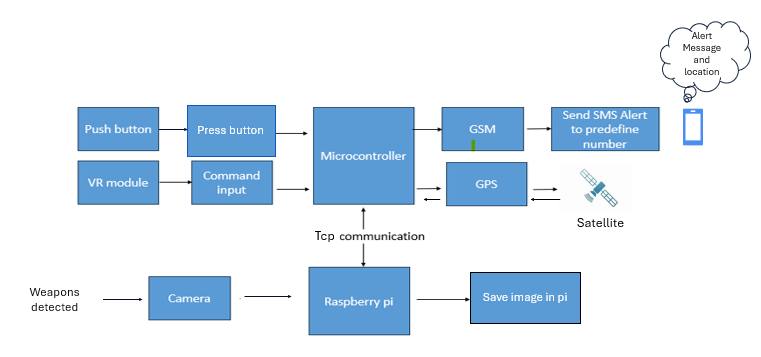

# 🛡  Saftey-device
This project is a Multimodal Smart Wearable Device designed to detect emergencies and instantly send SMS alerts along with live GPS location to trusted contacts.
It integrates AI-based weapon detection, multilingual voice command recognition, GPS tracking, GSM alerts, real-time evidence collection, and ESP32–Raspberry Pi communication into one compact wearable system.

The system detects emergencies via three input channels:
1. AI-based Weapon Detection (Gun/Knife using YOLOv8 & YOLO11)  
2. Multilingual Voice Recognition (“Help”, “Bachao”, “Maddad”)  
3. Physical Panic Button Trigger

When triggered:
•	Raspberry Pi   **captures an evidence image*
•	ESP32 reads **live GPS coordinates**
•	ESP32 sends **SMS with event type + Google Maps link**
•	System returns to monitoring mode automatically

This makes it ideal for:
•	Kidnapping attempts  
•	Robbery / armed assault  
•	Violence or harassment  
•	Emergency medical conditions  
•	Women & student safety  

# 🔧 1. Hardware Used
1.	Raspberry Pi 4 model b
2. ESP32
3. OV5647 Camera
4. VR3 Voice Recognition Module
5. NEO-6M GPS
6. GSM800L
7. Buttons, Wires, Power Unit

# ⭐ 2. Key Features
**🔫 Weapon Detection using AI (YOLOv8 )**
- Gun and knife detection  
- High accuracy using custom-trained model  
- Real-time inference on Raspberry Pi 4  
- Evidence image captured instantly  

 🎤 **Voice Command Recognition (VR3)** 
  Recognizes multilingual commands:
- Help (English)
- Bachao (Urdu)
- Maddad (Urdu)  
No internet required (hardware-based recognition).

 🚨 **Panic Button Trigger**
- Instant emergency detection  
- Works even if AI or voice commands are not triggered  

📍 **Live GPS Tracking**
- Uses NEO-6M GPS  
- Accurate up to 3–5 meters  
- Included as clickable Google Maps link  

✉️ **SMS Alerts**
- GSM800L sends emergency SMS  
- Works without internet  
- Fast delivery (4–7 seconds)  

**Evidence Collection**
- Raspberry Pi captures image with OV5647 camera  
- Timestamped  
- Stored in `/home/pi/Evidence/`

📡 **Offline Operation**
- ESP32 creates Wi-Fi AP  
- Pi connects locally  
- No mobile data or Wi-Fi needed  

 🔗 **Secure ESP32 ↔ Raspberry Pi Communication**
- TCP socket communication  
- Fully encrypted local network  

# System Arcitecture

# **Development Tools**
- Google Colab (Model Training)
- python
- VS Code  
- Arduino IDE
- Raspberry pi imager
- Sd card formatar
- Vnc Veiwer
